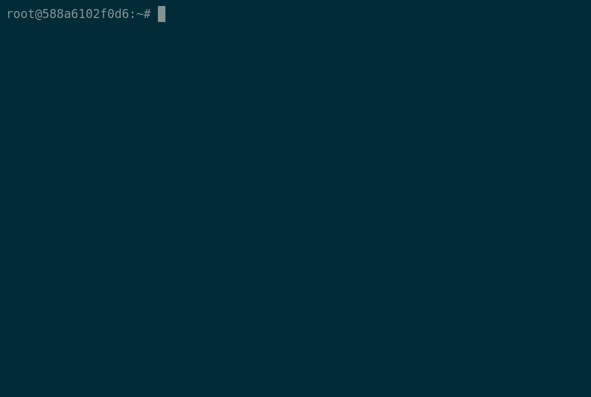

# webhookd

[](https://github.com/ncarlier/webhookd/actions/workflows/build.yml)
[](https://goreportcard.com/report/github.com/ncarlier/webhookd)
[](https://hub.docker.com/r/ncarlier/webhookd/)
[](https://www.paypal.me/nunux)

A very simple webhook server to launch shell scripts.


## At a glance



## Installation

Run the following command:

```bash
$ go install github.com/ncarlier/webhookd@latest
```

**Or** download the binary regarding your architecture:

```bash
$ sudo curl -s https://raw.githubusercontent.com/ncarlier/webhookd/master/install.sh | bash
or
$ curl -sf https://gobinaries.com/ncarlier/webhookd | sh
```

**Or** use Docker:

```bash
$ docker run -d --name=webhookd \
  -v ${PWD}/scripts:/scripts \
  -p 8080:8080 \
  ncarlier/webhookd
```

> Note: The official Docker image is lightweight and allows to run simple scripts but for more advanced needs you can use the `ncarlier/webhookd:edge-distrib` image.
> For example, with this `distrib` image, you can interact with your Docker daemon using Docker CLI or Docker Compose.

**Or** use APT:

Finally, it is possible to install Webhookd using the Debian packaging system through this [custom repository](https://packages.azlux.fr/).

> Note: Custom configuration variables can be set into `/etc/webhookd.env` file.
> Sytemd service is already set and enable, you just have to start it with `systemctl start webhookd`.

## Configuration

Webhookd can be configured by using command line parameters or by setting environment variables.

Type `webhookd -h` to display all parameters and related environment variables.

All configuration variables are described in [etc/default/webhookd.env](./etc/default/webhookd.env) file.

## Usage

### Directory structure

Webhooks are simple scripts within a directory structure.

By default inside the `./scripts` directory.
You can change the default directory using the `WHD_HOOK_SCRIPTS` environment variable or `-hook-scripts` parameter.

*Example:*

```
/scripts
|--> /github
  |--> /build.sh
  |--> /deploy.sh
|--> /push.js
|--> /echo.sh
|--> ...
```

> Note: Webhookd is able to run any type of file in this directory as long as the file is executable.
For example, you can execute a Node.js file if you give execution rights to the file and add the appropriate `#!` header (in this case: `#!/usr/bin/env node`).

You can find sample scripts in the [example folder](./scripts/examples).
In particular, examples of integration with Gitlab and Github.

### Webhook call

The directory structure define the webhook URL.

You can omit the script extension. If you do, webhookd will search by default for a `.sh` file.
You can change the default extension using the `WHD_HOOK_DEFAULT_EXT` environment variable or `-hook-default-ext` parameter.
If the script exists, the output will be send to the HTTP response.

Depending on the HTTP request, the HTTP response will be a HTTP `200` code with the script's output in real time (streaming), or the HTTP response will wait until the end of the script's execution and return the output (tuncated) of the script as well as an HTTP code relative to the script's output code.

The streaming protocol depends on the HTTP request:

- [Server-sent events][sse] is used when `Accept` HTTP header is equal to `text/event-stream`.
- [Chunked Transfer Coding][chunked] is used when `X-Hook-Mode` HTTP header is equal to `chunked`.
It's the default mode.
You can change the default mode using the `WHD_HOOK_DEFAULT_MODE` environment variable or `-hook-default-mode` parameter.

[sse]: https://developer.mozilla.org/en-US/docs/Web/API/Server-sent_events
[chunked]: https://datatracker.ietf.org/doc/html/rfc2616#section-3.6.1

If no streaming protocol is needed, yous must set `X-Hook-Mode` HTTP header to `buffered`.
The HTTP reponse will block until the script is over:

- Sends script output limited to the last 100 lines. You can modify this limit via the HTTP header `X-Hook-MaxBufferedLines`.
- Convert the script exit code to HTTP code as follow:
  - 0: `200 OK`
  - Between 1 and 99: `500 Internal Server Error`
  - Between 100 and 255: Add 300 to get HTTP code between 400 and 555

> Remember: a process exit code is between 0 and 255. 0 means that the execution is successful.

*Example:*

The script: `./scripts/foo/bar.sh`

```bash
#!/bin/bash

echo "foo foo foo"
echo "bar bar bar"

exit 118
```

Streamed output using  `Server-sent events`:

```bash
$ curl -v --header "Accept: text/event-stream" -XGET http://localhost:8080/foo/bar
< HTTP/1.1 200 OK
< Content-Type: text/event-stream
< Transfer-Encoding: chunked
< X-Hook-Id: 8

data: foo foo foo

data: bar bar bar

error: exit status 118
```

Streamed output using `Chunked Transfer Coding`:

```bash
$ curl -v -XPOST --header "X-Hook-Mode: chunked" http://localhost:8080/foo/bar
< HTTP/1.1 200 OK
< Content-Type: text/plain; charset=utf-8
< Transfer-Encoding: chunked
< X-Hook-Id: 7

foo foo foo
bar bar bar
error: exit status 118

```

Blocking HTTP request:

```bash
$ curl -v -XPOST --header "X-Hook-Mode: buffered" http://localhost:8080/foo/bar
< HTTP/1.1 418 I m a teapot
< Content-Type: text/plain; charset=utf-8
< X-Hook-Id: 9

foo foo foo
bar bar bar
error: exit status 118
```

> Note that in this last example the HTTP response is equal to `exit code + 300` : `318 I'm a teapot`.

### Webhook parameters

You have several ways to provide parameters to your webhook script:

- URL request parameters are converted to script variables
- HTTP headers are converted to script variables
- Request body (depending the Media Type):
  - `application/x-www-form-urlencoded`: keys and values are converted to script variables
  - `text/*` or `application/json`: payload is transmit to the script as first parameter.

> Note: Variable name follows "snakecase" naming convention.
Therefore the name can be altered.
*ex: `CONTENT-TYPE` will become `content_type`.*

Webhookd adds some additional parameters to the script:

- `hook_id`: hook ID (auto-increment)
- `hook_name`: hook name
- `hook_method`: HTTP request method
- `x_forwarded_for`: client IP
- `x_webauth_user`: username if authentication is enabled

*Example:*

The script:

```bash
#!/bin/bash

echo "Hook information: name=$hook_name, id=$hook_id, method=$hook_method"
echo "Query parameter: foo=$foo"
echo "Header parameter: user-agent=$user_agent"
echo "Script parameters: $1"
```

The result:

```bash
$ curl --data @test.json -H 'Content-Type: application/json' http://localhost:8080/echo?foo=bar
Hook information: name=echo, id=1, method=POST
Query parameter: foo=bar
Header parameter: user-agent=curl/7.52.1
Script parameter: {"message": "this is a test"}
```

### Webhook timeout configuration

By default a webhook has a timeout of 10 seconds.
This timeout is globally configurable by setting the environment variable:
`WHD_HOOK_TIMEOUT` (in seconds).

You can override this global behavior per request by setting the HTTP header:
`X-Hook-Timeout` (in seconds).

*Example:*

```bash
$ curl -H "X-Hook-Timeout: 5" http://localhost:8080/echo?foo=bar
```

### Webhook logs

As mentioned above, web hook logs are stream in real time during the call.
However, you can retrieve the logs of a previous call by using the hook ID: `http://localhost:8080/<NAME>/<ID>`

The hook ID is returned as an HTTP header with the Webhook response: `X-Hook-ID`

*Example:*

```bash
$ # Call webhook
$ curl -v http://localhost:8080/echo?foo=bar
...
< HTTP/1.1 200 OK
< Content-Type: text/plain
< X-Hook-Id: 2
...
$ # Retrieve logs afterwards
$ curl http://localhost:8080/echo/2
```

If needed, you can also redirect hook logs to the server output (configured by the `WHD_LOG_MODULES=hook` environment variable).

### Post hook notifications

The output of the script is collected and stored into a log file
(configured by the `WHD_HOOK_LOG_DIR` environment variable).

Once the script is executed, you can send the result and this log file to a notification channel.
Currently, only two channels are supported: `Email` and `HTTP`.

Notifications configuration can be done as follow:

```bash
$ export WHD_NOTIFICATION_URI=http://requestb.in/v9b229v9
$ # or
$ webhookd --notification-uri=http://requestb.in/v9b229v9
```

> Note: Only the output of the script prefixed by "notify:" is sent to the notification channel.
If the output does not contain a prefixed line, no notification will be sent.

**Example:**

```bash
#!/bin/bash

echo "notify: Hello World" # Will be notified
echo "Goodbye"             # Will not be notified
```

You can override the notification prefix by adding `prefix` as a query parameter to the configuration URL.

**Example:** http://requestb.in/v9b229v9?prefix="foo:"

#### HTTP notification

Configuration URI: `http://example.org`

Options (using query parameters):

- `prefix`: Prefix to filter output log

The following JSON payload is POST to the target URL:

```json
{
  "id": "42",
  "name": "echo",
  "text": "foo\nbar...\n",
  "error": "Error cause... if present",
}
```

> Note: that because the payload have a `text` attribute, you can use a [Mattermost][mattermost], [Slack][slack] or [Discord][discord] webhook endpoint.

[mattermost]: https://docs.mattermost.com/developer/webhooks-incoming.html
[discord]: https://discord.com/developers/docs/resources/webhook#execute-slackcompatible-webhook
[slack]: https://api.slack.com/messaging/webhooks

#### Email notification

Configuration URI: `mailto:foo@bar.com`

Options (using query parameters):

- `prefix`: Prefix to filter output log
- `smtp`: SMTP host to use (by default: `localhost:25`)
- `username`: SMTP username (not set by default)
- `password`: SMTP password (not set by default)
- `conn`: SMTP connection type (`tls`, `tls-insecure` or by default: `plain`)
- `from`: Sender email (by default: `noreply@nunux.org`)
- `subject`: Email subject (by default: `[whd-notification] {name}#{id} {status}`)

### Authentication

You can restrict access to webhooks using HTTP basic authentication.

To activate basic authentication, you have to create a `htpasswd` file:

```bash
$ # create passwd file the user 'api'
$ htpasswd -B -c .htpasswd api
```
This command will ask for a password and store it in the htpawsswd file.

By default, the daemon will try to load the `.htpasswd` file.
But you can override this behavior by specifying the location of the file:

```bash
$ export WHD_PASSWD_FILE=/etc/webhookd/users.htpasswd
$ # or
$ webhookd --passwd-file /etc/webhookd/users.htpasswd
```

Once configured, you must call webhooks using basic authentication:

```bash
$ curl -u api:test -XPOST "http://localhost:8080/echo?msg=hello"
```

### Signature

You can ensure message integrity (and authenticity) by signing HTTP requests.

Webhookd supports 2 signature methods:

- [HTTP Signatures](https://www.ietf.org/archive/id/draft-cavage-http-signatures-12.txt)
- [Ed25519 Signature](https://ed25519.cr.yp.to/) (used by [Discord](https://discord.com/developers/docs/interactions/receiving-and-responding#security-and-authorization))

To activate request signature verification, you have to configure the truststore:

```bash
$ export WHD_TRUSTSTORE_FILE=/etc/webhookd/pubkey.pem
$ # or
$ webhookd --truststore-file /etc/webhookd/pubkey.pem
```

Public key is stored in PEM format.

Once configured, you must call webhooks using a valid signature:

```bash
# Using HTTP Signature:
$ curl -X POST \
  -H 'Date: <req-date>' \
  -H 'Signature: keyId=<key-id>,algorithm="rsa-sha256",headers="(request-target) date",signature=<signature-string>' \
  -H 'Accept: application/json' \
  "http://localhost:8080/echo?msg=hello"
# or using Ed25519 Signature:
$ curl -X POST \
  -H 'X-Signature-Timestamp: <timestamp>' \
  -H 'X-Signature-Ed25519: <signature-string>' \
  -H 'Accept: application/json' \
  "http://localhost:8080/echo?msg=hello"
```

You can find a small HTTP client in the ["tooling" directory](./tooling/httpsig/README.md) that is capable of forging `HTTP signatures`.

### TLS

You can activate TLS to secure communications:

```bash
$ export WHD_TLS_ENABLED=true
$ # or
$ webhookd --tls-enabled
```

By default webhookd is expecting a certificate and key file (`./server.pem` and `./server.key`).
You can provide your own certificate and key with `-tls-cert-file` and `-tls-key-file`.

Webhookd also support [ACME](https://ietf-wg-acme.github.io/acme/) protocol.
You can activate ACME by setting a fully qualified domain name:

```bash
$ export WHD_TLS_ENABLED=true
$ export WHD_TLS_DOMAIN=hook.example.com
$ # or
$ webhookd --tls-enabled --tls-domain=hook.example.com
```

**Note:**
On *nix, if you want to listen on ports 80 and 443, don't forget to use `setcap` to privilege the binary:

```bash
sudo setcap CAP_NET_BIND_SERVICE+ep webhookd
```

## License

The MIT License (MIT)

See [LICENSE](./LICENSE) to see the full text.

---
